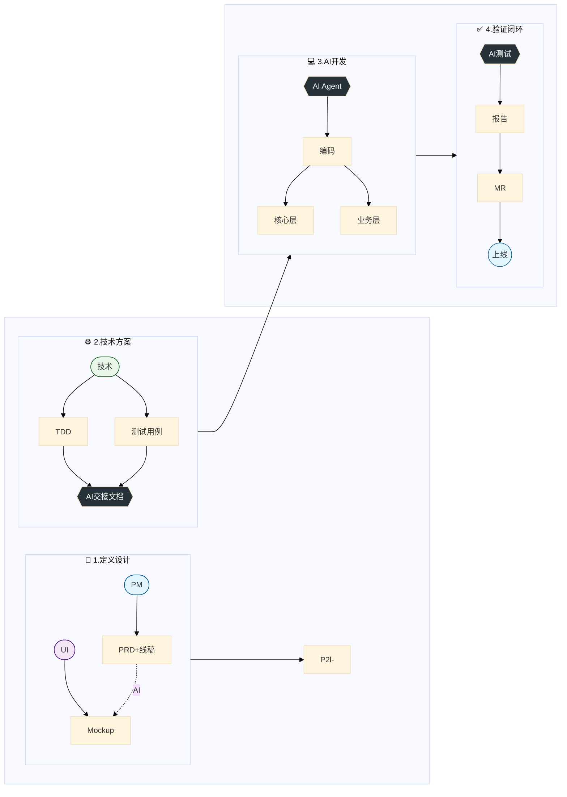
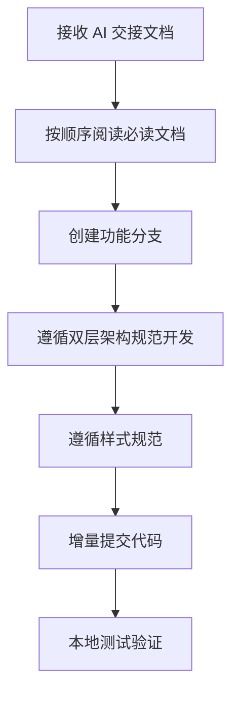
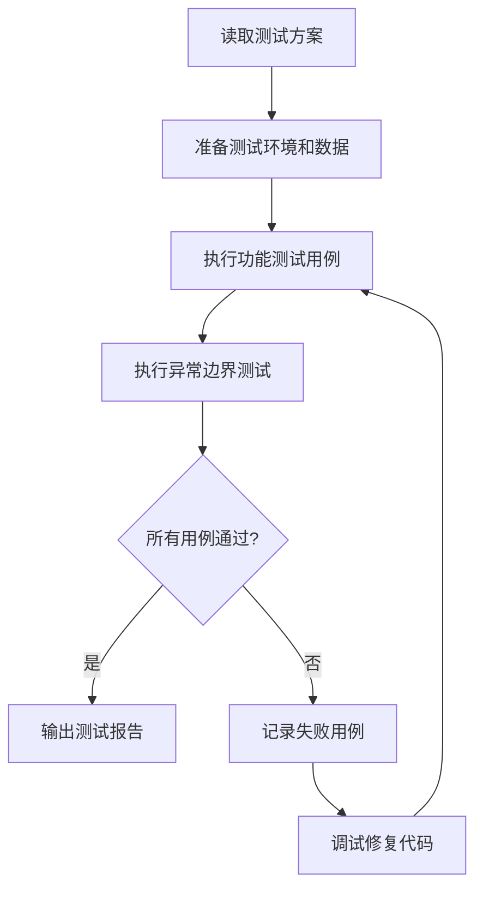

# AI 协作开发全流程最佳实践

> 📌 **目标读者**：产品经理、UI 设计师、前后端开发者、测试工程师  
> **核心价值**：将产品→设计→开发→测试→部署全链路串联，形成闭环

---

## 🎯 整体架构概览



---

## 1️⃣ 产品侧（PM 阶段）

### 1.1 PRD 规范输出

**规范文档位置**：`doc/01规范体系/PRD输出规范/PRD生成规范-产品视角.md`

**标准结构（9 大章节）**：

| 章节              | 内容要求                                   |
| ----------------- | ------------------------------------------ |
| 1. 功能目标       | 1-2 句话说明解决什么问题                   |
| 2. 用户场景       | 至少 2-3 个真实场景（引用格式 + 用户诉求） |
| 3. 入口位置       | 用表格列出所有入口及触发方式               |
| 4. 界面布局与交互 | ASCII 图/Mermaid 图 + HTML Mockup          |
| 5. 字段说明       | 表格列出必填性、输入方式、字符限制         |
| 6. 交互逻辑       | 表格说明触发条件 → 系统响应 → 结果状态     |
| 7. 交互流程图     | Mermaid 图展示核心流程（含异常分支）       |
| 8. 异常与边界     | 列出所有错误场景及处理方式                 |
| 9. 文案规范       | 列出所有 UI 文案（按钮、提示、标签）       |

**❌ 禁止包含内容**：
- 技术实现细节（如 Vue 3 Composition API）
- 接口设计（如 `POST /api/xxx`）
- 数据结构定义（如 `interface BriefData`）
- 开发排期
- AI Prompt 设计
- 组件命名

### 1.2 线稿与流程图输出

**新增要求**：PRD 中涉及 UI 交互的部分，必须附带：

1. **ASCII 线稿图**：展示界面布局和元素位置
2. **Mermaid 流程图**：展示交互流程和决策分支
3. **HTML Mockup**（可选）：创建独立 HTML 文件展示高保真效果

---

## 2️⃣ UI 交互侧（设计阶段）

### 2.1 前端规范分析

**操作流程**：

1. **获取项目代码**：从 GitLab 克隆项目仓库
2. **分析前端规范**：阅读以下文档
   - `doc/01规范体系/02-技术规范/前端/前端开发规范_完整版.md`
   - `doc/01规范体系/02-技术规范/前端/组件库使用指南_V1.0.md`
   - `.cursorrules`（样式硬约束）

3. **提取核心规范**：
   | 规范类型   | 内容                                          |
   | ---------- | --------------------------------------------- |
   | 主色       | `var(--primary-color)` (#0032FF 蓝色)         |
   | 渐变色     | `var(--primary-gradient)` (#0032FF → #7D71FF) |
   | 样式优先级 | CSS变量 → Less变量 → UnoCSS → 自定义          |
   | 间距       | `@padding-md: 16px`、`@padding-sm: 12px`      |
   | 阴影       | `@shadow-2-down`                              |

### 2.2 高保真设计稿输出

**使用 Gemini 3 Pro 生成 HTML 设计稿**：

1. **输入**：PRD 线稿 + 前端 UI 规范
2. **输出**：`mockups/ui_mockups_[模块名].html`
3. **要求**：
   - 严格遵循项目主色变量
   - 包含关键状态（默认态、加载态、结果态）
   - 可在 VS Code 直接预览

---

## 3️⃣ 技术文档输出

### 3.1 技术方案文档（TDD）

**模板位置**：`doc/01规范体系/技术文档输出规范/技术方案模板.md`

**标准结构**：

```markdown
## 1. 方案概述
### 1.1 背景与目标
### 1.2 总体架构（Mermaid 架构图）

## 2. 详细设计
### 2.1 流程设计（时序图/流程图）
### 2.2 接口设计（API）
  - URL、请求参数、响应结构
### 2.3 数据结构
  - 前端状态 (Store)
  - 数据库模型

## 3. 实现要点
### 3.1 关键技术点
### 3.2 依赖项

## 4. 异常与兜底
### 4.1 异常处理（错误码、处理策略、用户提示）
### 4.2 降级方案

## 5. 安全与性能
### 5.1 安全性
### 5.2 性能要求
```

### 3.2 测试用例文档

**模板位置**：`doc/01规范体系/测试文档输出规范/测试方案模板.md`

**标准结构**：

```markdown
## 1. 测试概述
### 1.1 测试目标
### 1.2 测试范围（功能/兼容性/性能）

## 2. 测试环境
### 2.1 依赖服务
### 2.2 测试数据

## 3. 测试用例
### 3.1 功能测试用例
| ID | 模块 | 测试场景 | 前置条件 | 操作步骤 | 预期结果 | 优先级 |

### 3.2 异常与边界测试
| ID | 场景 | 操作步骤 | 预期结果 |

## 4. 验收标准
### 4.1 功能验收
### 4.2 性能验收
```

### 3.3 AI 交接文档

**目的与价值**：
- 确保 AI 理解完整上下文，避免重复沟通
- 明确开发边界和规范约束
- 加速开发启动，减少出错

**标准结构**：

```markdown
## 📋 任务概述
[简述功能目标和核心价值]

## 📁 必读文档（按顺序阅读）
| 序号 | 文档 | 路径 | 作用 |
| 1 | PRD | doc/03PRD2.0/[模块名]/PRD.md | 功能定义 |
| 2 | TDD | doc/03PRD2.0/[模块名]/TDD.md | 技术架构 |
| 3 | 测试方案 | doc/03PRD2.0/[模块名]/测试方案.md | 验收标准 |
| 4 | 前端规范 | doc/01规范体系/02-技术规范/前端/... | 样式规范 |
| 5 | 双层架构 | doc/01规范体系/02-技术规范/前端/双层架构规范.md | 代码归属 |

## 🌿 分支操作
- 创建分支命令
- 提交规范
- 推送命令

## 🏗️ 技术拆分
| 功能点 | 归属层 | 路径参考 | 技术要点 |

## ⚠️ 开发规范
1. 样式规范
2. 交互规范
3. 组件复用要求

## ✅ 验收标准
- [ ] 清单项 1
- [ ] 清单项 2

## 📞 遇到问题时
[指向相关文档的索引]
```

---

## 4️⃣ 开发阶段

### 4.1 基于交接文档开发

**开发流程**：



### 4.2 遵照规范体系

**双层架构规范**：

| 层级           | 项目              | 职责                                  |
| -------------- | ----------------- | ------------------------------------- |
| **白板核心层** | `style3d-board/`  | 画布引擎、工具栏框架、菜单系统        |
| **业务层**     | `style_homesite/` | 企划中心、趋势分析、AI 面板等业务功能 |

**通信机制**：
- 核心层 → 业务层：SDK 方法调用 `boardSDK.openPanel()`
- 业务层 → 核心层：事件回调 `boardSDK.on('event', callback)`

**开发前必做**：
1. 查找该功能的技术方案文档
2. 阅读「技术拆分」章节，明确代码归属
3. 检查是否有可复用组件

---

## 5️⃣ 测试阶段

### 5.1 使用 AI 执行测试用例

**操作方式**：

```markdown
指令示例：
"请根据 doc/03PRD2.0/M1.1-PDF智能提取功能/M1.1-PDF智能提取功能测试方案.md 
执行测试用例，并输出测试报告"
```

**测试执行流程**：



### 5.2 输出测试报告

**测试报告结构**：

```markdown
## 测试执行报告

### 1. 测试概要
- 执行时间：YYYY-MM-DD
- 测试环境：[描述]
- 总用例数：X
- 通过数：X
- 失败数：X

### 2. 用例执行结果
| ID | 场景 | 结果 | 备注 |

### 3. 发现的问题
[问题描述和截图]

### 4. 验收结论
- [ ] 功能验收通过
- [ ] 性能验收通过
```

---

## 6️⃣ 提交与交付

### 6.1 GitLab 提交流程

**PM-AI 协作工作流**：

| 节点     | 指令                  | 动作                  |
| -------- | --------------------- | --------------------- |
| 开始开发 | `/开始开发 M1-模块名` | 创建分支 + 初始化环境 |
| 开发迭代 | [持续对话]            | 增量提交 + 文档同步   |
| 提交代码 | `/提交开发 M1-模块名` | 推送 + 生成 MR 链接   |
| 暂停模式 | `/暂停开发`           | git stash + 任务切换  |

### 6.2 Merge Request 创建

1. 登录 GitLab → 进入项目
2. 点击 **Merge Requests** → **New merge request**
3. 选择分支：
   - Source: `feature/M1.1-pdf-extract`
   - Target: `main` 或 `develop`
4. 填写 MR 信息：
   - Title: `feat(M1.1): PDF 智能提取功能`
   - Description: 关联 PRD 链接、功能说明、测试情况
5. 指派 Reviewer → 创建

### 6.3 Code Review 与合并

**CR 检查清单**：

```markdown
## 功能性
- [ ] 代码实现了需求描述的功能
- [ ] 边界条件处理正确
- [ ] 错误处理完善

## 代码质量
- [ ] 遵循项目编码规范
- [ ] 命名清晰有意义
- [ ] 无重复代码

## 样式规范
- [ ] 使用 var(--primary-color) 作为主色
- [ ] 遵循样式优先级
- [ ] 图片使用 OSS 优化

## 测试
- [ ] 测试用例全部通过
- [ ] 核心场景已验证
```

---

## 7️⃣ 规范体系补充说明

### 7.1 规范体系完整结构

```
doc/01规范体系/
├── README.md                    ← 总索引
├── AI-编程协作规范_V1.0.md       ← 总纲（8个研发阶段）
├── PM-AI协作工作流规范.md        ← PM 开发协作节点
├── 产品经理AI开发协作指南.md     ← Git 操作指南
├── 团队AI协作指南.md             ← 团队培训材料
├── 文档使用索引表.md             ← 快速查找文档
│
├── PRD输出规范/
│   ├── PRD生成规范-产品视角.md   ← PRD 标准结构
│   └── prd生成prompt.md
│
├── 技术文档输出规范/
│   └── 技术方案模板.md           ← TDD 模板
│
├── 测试文档输出规范/
│   └── 测试方案模板.md           ← 测试方案模板
│
└── 02-技术规范/
    └── 前端/
        ├── README.md
        ├── 前端开发规范_完整版.md  ← 样式、组件、开发模式
        ├── 组件库使用指南_V1.0.md ← 28+ 组件详细说明
        ├── 开发检查清单.md        ← 三阶段自检清单
        └── 双层架构规范.md        ← 核心层/业务层边界
```

### 7.2 各角色文档索引

| 角色           | 必读文档                                                 |
| -------------- | -------------------------------------------------------- |
| **产品经理**   | PRD生成规范、PM-AI协作工作流规范、产品经理AI开发协作指南 |
| **UI 设计师**  | 前端开发规范_完整版、组件库使用指南                      |
| **前端开发**   | 前端开发规范_完整版、双层架构规范、开发检查清单          |
| **测试工程师** | 测试方案模板、AI-编程协作规范（测试章节）                |
| **全员**       | AI-编程协作规范_V1.0、团队AI协作指南                     |

### 7.3 工具配置

| 工具                | 规范加载方式                                |
| ------------------- | ------------------------------------------- |
| **Claude Code CLI** | ✅ 自动加载 `.claude/frontend-guidelines.md` |
| **Cursor**          | ✅ 自动加载 `.cursorrules`                   |
| **Antigravity**     | ⚠️ 需手动引用 `AI-DEVELOPMENT-GUIDE.md`      |
| **其他工具**        | ⚠️ 需手动告知 AI 规范位置                    |

---

**文档版本**：V1.0  
**创建日期**：2026-01-20  
**维护者**：产品团队
