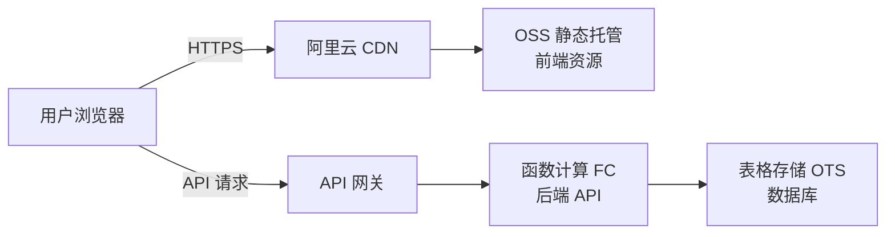

# Temporal 域名上线部署指南

> 📌 本文档指导如何将 Temporal 应用部署到阿里云,并通过自定义域名访问  
> 🎯 **目标**: 用户可以通过你的域名(如 `temporal.yourdomain.com`)直接访问应用
> 
> ⚠️ **发布规范**: 每次上线前，请务必参考 [发布迭代规范](../01_规范体系/发布迭代规范.md) 进行版本管理和检查。

---

## ✅ 快速发布检查清单 (Pre-Release Checklist)

在执行 `npm run deploy` 之前，请确认：

- [ ] **版本号**: `package.json` 中的 version 已更新？
- [ ] **构建**: `npm run build` 在本地执行成功且无报错？
- [ ] **环境**: `.env.local` 中的 `VITE_API_BASE_URL` 是否指向线上 API？
- [ ] **验证**: 本地功能测试已通过？

---

## 📋 部署架构概览

Temporal 采用前后端分离架构:



**核心组件**:
- **前端**: React + Vite 构建的 SPA,部署到 OSS
- **后端**: Node.js HTTP 服务,部署到函数计算
- **数据库**: 表格存储 (TableStore)
- **域名**: 通过 CDN 绑定自定义域名

---

## 🚀 部署步骤

### 阶段 1: 前端部署到 OSS

#### 1.1 构建前端资源

```bash
cd /Users/linctex/Desktop/vibe/时间管理/temporal
npm run build
```

> ✅ 构建完成后会生成 `dist/` 目录

#### 1.2 配置环境变量

确保 `.env.local` 文件包含以下配置:

```bash
# OSS 配置
OSS_ACCESS_KEY_ID=你的AccessKey
OSS_ACCESS_KEY_SECRET=你的AccessKeySecret

# API 配置(后续配置)
VITE_API_BASE_URL=https://你的API域名
```

> ⚠️ **重要**: `.env.local` 不要提交到 Git,已在 `.gitignore` 中排除

#### 1.3 部署到 OSS

```bash
npm run deploy
```

这个命令会:
1. 上传所有文件到 OSS Bucket `temporal-app-nick`
2. 设置正确的 Content-Type
3. 配置缓存策略(静态资源缓存 1 年,HTML 不缓存)

#### 1.4 配置 OSS 静态网站托管

登录阿里云 OSS 控制台:

1. 进入 Bucket `temporal-app-nick`
2. **基础设置** → **静态页面**
   - 默认首页: `index.html`
   - 默认 404 页: `index.html` (SPA 路由需要)
3. **权限管理** → **读写权限**
   - 设置为 **公共读**

---

### 阶段 2: 后端 API 部署到函数计算

#### 2.1 准备 API 代码包

```bash
cd /Users/linctex/Desktop/vibe/时间管理/temporal/aliyun-fc/api
zip -r temporal-api.zip .
```

#### 2.2 创建函数计算服务

登录阿里云函数计算控制台:

1. **创建服务**
   - 服务名称: `temporal-service`
   - 日志配置: 启用(推荐)
   - VPC 配置: 不需要(表格存储支持公网访问)

2. **创建函数**
   - 函数名称: `temporal-api`
   - 运行环境: `Node.js 18`
   - 函数入口: `index.handler`(HTTP 触发器会自动调用)
   - 内存规格: `512 MB`
   - 超时时间: `60 秒`

3. **上传代码**
   - 上传方式: ZIP 包
   - 选择 `temporal-api.zip`

#### 2.3 配置环境变量

在函数配置中添加:

```bash
ACCESS_KEY_ID=你的AccessKey
ACCESS_KEY_SECRET=你的AccessKeySecret
FC_SERVER_PORT=9000
```

#### 2.4 配置 HTTP 触发器

1. **触发器类型**: HTTP 触发器
2. **请求方法**: GET, POST, PUT, DELETE
3. **鉴权方式**: anonymous(匿名访问)
4. **获取触发器 URL**: 类似 `https://xxx.cn-hangzhou.fc.aliyuncs.com/2016-08-15/proxy/temporal-service/temporal-api/`

> 📝 记录这个 URL,后续需要配置到前端

#### 2.5 配置定时保活(可选但推荐)

为避免冷启动,创建定时触发器:

1. **触发器类型**: 定时触发器
2. **触发规则**: `cron(0 */5 * * * *)` (每 5 分钟)
3. **触发消息**: `{"path": "/api/keep-warm"}`

---

### 阶段 3: 域名绑定与 CDN 配置

#### 3.1 前端域名配置(OSS + CDN)

##### 3.1.1 创建 CDN 加速域名

登录阿里云 CDN 控制台:

1. **添加域名**
   - 加速域名: `temporal.yourdomain.com` (替换为你的域名)
   - 业务类型: **全站加速**
   - 源站类型: **OSS 域名**
   - 源站域名: `temporal-app-nick.oss-cn-hangzhou.aliyuncs.com`
   - 端口: `80`

2. **HTTPS 配置**
   - 申请免费 SSL 证书(阿里云提供)
   - 或上传已有证书
   - 启用 **强制 HTTPS 跳转**

3. **缓存配置**
   - `/index.html`: 不缓存
   - `/assets/*`: 缓存 1 年
   - 其他: 缓存 1 天

4. **回源配置**
   - 回源 HOST: `temporal-app-nick.oss-cn-hangzhou.aliyuncs.com`
   - 回源协议: **跟随**

##### 3.1.2 配置 DNS 解析

在你的域名服务商(阿里云域名控制台):

1. **添加 CNAME 记录**
   - 记录类型: `CNAME`
   - 主机记录: `temporal`
   - 记录值: CDN 分配的 CNAME 地址(如 `temporal.yourdomain.com.w.kunlunsl.com`)
   - TTL: `10 分钟`

> ⏱️ DNS 生效需要 10 分钟到 24 小时

#### 3.2 后端 API 域名配置(函数计算 + API 网关)

##### 3.2.1 创建 API 网关

登录阿里云 API 网关控制台:

1. **创建 API 分组**
   - 分组名称: `temporal-api-group`
   - 二级域名: 自动生成

2. **创建 API**
   - API 名称: `temporal-api`
   - 请求路径: `/api/*`
   - 请求方法: `ANY`(支持所有方法)
   - 后端服务类型: **函数计算**
   - 函数计算配置:
     - 服务: `temporal-service`
     - 函数: `temporal-api`
     - 路径: `/*`

3. **绑定自定义域名**
   - 域名: `api.yourdomain.com`
   - 协议: `HTTPS`
   - 证书: 上传或申请 SSL 证书

##### 3.2.2 配置 DNS 解析

添加 API 域名的 CNAME 记录:

```
记录类型: CNAME
主机记录: api
记录值: API 网关分配的 CNAME
```

---

### 阶段 4: 前端 API 地址配置

#### 4.1 更新环境变量

编辑 `/Users/linctex/Desktop/vibe/时间管理/temporal/.env.local`:

```bash
VITE_API_BASE_URL=https://api.yourdomain.com
```

#### 4.2 重新构建并部署

```bash
npm run build
npm run deploy
```

---

### 阶段 5: CORS 跨域配置

#### 5.1 后端 CORS 配置

后端代码 `aliyun-fc/api/index.js` 已配置 CORS:

```javascript
const corsHeaders = {
    'Access-Control-Allow-Origin': '*',
    'Access-Control-Allow-Methods': 'GET, POST, PUT, DELETE, OPTIONS',
    'Access-Control-Allow-Headers': 'Content-Type',
};
```

> ⚠️ **生产环境建议**: 将 `*` 改为你的前端域名 `https://temporal.yourdomain.com`

#### 5.2 OSS CORS 配置

在 OSS Bucket 设置中:

1. **跨域设置** → **创建规则**
   - 来源: `https://temporal.yourdomain.com`
   - 允许 Methods: `GET, POST, PUT, DELETE, HEAD`
   - 允许 Headers: `*`
   - 暴露 Headers: `ETag, x-oss-request-id`
   - 缓存时间: `600 秒`

---

## ✅ 部署验证清单

### 前端验证

- [ ] 访问 `https://temporal.yourdomain.com` 能正常加载
- [ ] 刷新页面不会 404(SPA 路由正常)
- [ ] 静态资源(CSS/JS/图片)加载正常
- [ ] HTTPS 证书有效(浏览器无警告)

### 后端验证

- [ ] 访问 `https://api.yourdomain.com/api/sync` 返回 JSON 数据
- [ ] 前端能正常调用 API(查看浏览器 Network 面板)
- [ ] 跨域请求无错误(无 CORS 报错)

### 功能验证

- [ ] 创建任务功能正常
- [ ] 拖拽任务功能正常
- [ ] 数据持久化(刷新后数据不丢失)
- [ ] 日期切换功能正常

---

## 🔧 常见问题排查

### 问题 1: 访问域名显示 404

**可能原因**:
- DNS 未生效
- CDN 缓存未刷新
- OSS 静态网站托管未配置

**解决方案**:
```bash
# 1. 检查 DNS 解析
nslookup temporal.yourdomain.com

# 2. 刷新 CDN 缓存(阿里云 CDN 控制台)
# 3. 检查 OSS 静态网站托管配置
```

### 问题 2: API 请求失败(CORS 错误)

**错误信息**: `Access to fetch at 'https://api.yourdomain.com' from origin 'https://temporal.yourdomain.com' has been blocked by CORS policy`

**解决方案**:
1. 检查后端 CORS 配置
2. 确认 API 网关允许跨域
3. 检查浏览器控制台的具体错误信息

### 问题 3: 刷新页面 404

**原因**: SPA 路由配置问题

**解决方案**:
- OSS 静态网站托管的 404 页面设置为 `index.html`
- CDN 回源配置正确

### 问题 4: 函数计算冷启动慢

**解决方案**:
- 配置定时触发器保活(每 5 分钟)
- 升级到预留实例(付费)

---

## 📊 成本估算

| 服务     | 规格              | 月费用(估算)   |
| -------- | ----------------- | -------------- |
| OSS 存储 | 1GB               | ¥0.12          |
| OSS 流量 | 10GB              | ¥0.50          |
| CDN 流量 | 10GB              | ¥2.00          |
| 函数计算 | 512MB, 10万次调用 | ¥1.00          |
| 表格存储 | 1GB, 10万次读写   | ¥0.50          |
| **总计** |                   | **约 ¥4-5/月** |

> 💡 **优化建议**: 
> - 使用阿里云资源包可降低成本
> - 函数计算按量付费,实际使用量低时成本更低

---

## 🔐 安全建议

### 1. 环境变量管理

- ✅ 使用阿里云 KMS 加密敏感信息
- ✅ 定期轮换 AccessKey
- ❌ 不要将 `.env.local` 提交到 Git

### 2. API 安全

- 考虑添加 API 鉴权(JWT Token)
- 限制 API 调用频率(API 网关流控)
- 记录访问日志(函数计算日志服务)

### 3. HTTPS 强制

- 所有域名强制 HTTPS
- 使用 HSTS 头部
- 定期更新 SSL 证书

---

## 📚 相关文档

- [阿里云 OSS 文档](https://help.aliyun.com/product/31815.html)
- [阿里云函数计算文档](https://help.aliyun.com/product/50980.html)
- [阿里云 CDN 文档](https://help.aliyun.com/product/27099.html)
- [前端开发规范](file:///Users/linctex/Desktop/vibe/时间管理/doc/01_规范体系/前端开发规范.md)
- [后端开发规范](file:///Users/linctex/Desktop/vibe/时间管理/doc/01_规范体系/后端开发规范.md)

---

## 🎯 下一步

部署完成后,建议:

1. **监控配置**: 配置阿里云云监控,监控 API 调用量和错误率
2. **备份策略**: 配置表格存储自动备份
3. **性能优化**: 根据访问日志优化 CDN 缓存策略
4. **用户反馈**: 收集用户反馈,持续优化

---

© 2026 Temporal Team. 如有问题,请查看 [迭代开发表](file:///Users/linctex/Desktop/vibe/时间管理/doc/02_产品定义/迭代开发表.md) 或提交 Issue。
